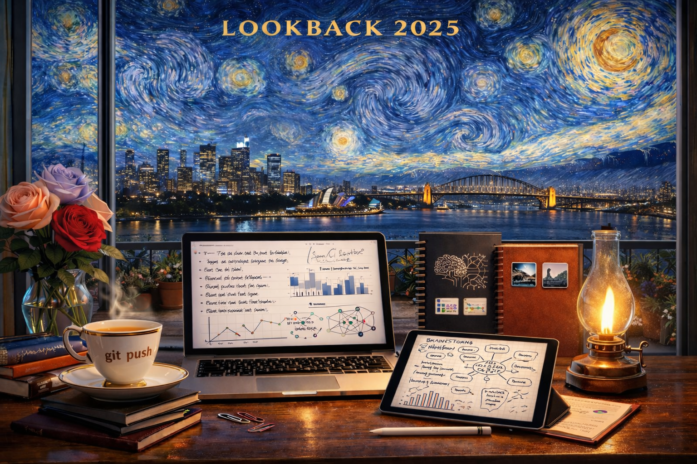

  

# LongC

This repository represents my professional GitHub portfolio.

👋 Hi, I’m Long.
💡 Data Scientist passionate about health, biology, maths, and chemistry — with strong curiosity for business, banking, and finance, harnessing data storytelling to drive impact, trust, and positive change.
🔬 PhD in Molecular Biology & Biochemistry | Data Scientist | AI & Analytics Enthusiast

I believe data tells powerful stories — and when harvested correctly, it can drive meaningful impact across every industry. My passion lies in transforming raw information into insights that improve human health, guide business decisions, and build stronger communities.

# 💡 About Me

🌱 Passionate about health analytics, building predictive models for disease to improve and save lives

📊 Interested in how data features interact in business contexts, supporting evidence-based decisions for stakeholders, staff, and economic stability

🏦 Keen to apply data science in banking and finance, including fraud detection, credit risk assessment, and financial crime surveillance

✨ I see data not just as numbers, but as stories that shape our world

# 🚀 What I Do

Data Science & Analytics — Python, SQL, R, pandas, NumPy, scikit-learn, matplotlib, seaborn

Machine Learning & AI — predictive modelling, anomaly detection, NLP, generative AI

Dashboards & Storytelling — IBM Cognos Analytics, Power BI, interactive visualisations

Research & Writing — peer-reviewed publications, reviews, and a book chapter

## AI Model Training & Evaluation — human-in-the-loop systems, rubric-based evaluation, prompt analysis

## 🧠 AI Training & Model Evaluation

I actively contribute to AI model training and evaluation, focusing on improving the reliability, safety, and usefulness of large language models (LLMs).

## 🤖 AI Training Contributor — Outlier AI

Evaluating and ranking model responses across STEM, analytics, and reasoning tasks

Applying rubric-based assessment for accuracy, reasoning quality, and guideline adherence

Identifying error patterns, hallucinations, and logical inconsistencies

Providing structured feedback to improve model behaviour and alignment

Working within human-in-the-loop AI systems at scale

🧪 I bridge scientific reasoning with real-world AI evaluation, bringing research-grade rigor to applied AI systems.

This work strengthens my skills in:

- model validation and quality control

- prompt engineering and response optimisation

- ethical AI and responsible deployment

# 📂 Featured Projects

📊 **Stack Overflow Tech Trends (Capstone Project)**
End-to-end data analysis and storytelling using the 2023 Developer Survey — data wrangling, exploratory analysis, and interactive dashboards highlighting emerging technology trends.

🛍️ **Online Retail Analytics (Capstone Project)**
Comprehensive EDA on retail transaction data — customer segmentation, RFM analysis, sales trends, and business insights to support data-driven decision-making.

🌦️ **Weather Forecast & Analytics Dashboard**
Data ingestion and analysis of weather data using Python pipelines and visualisations to explore trends, patterns, and short-term forecasting insights.

🏡 **House Price Prediction**
Machine learning models for housing price prediction, experimenting with regression techniques, feature engineering, and model evaluation.

🧪 **ReTimeML (Published Research Project)**
A retention time predictor supporting LC–MS/MS analysis of sphingolipids — applying machine learning to predict lipid class behaviour in biological systems.

🎨 **Personal Portfolio Website**
A responsive portfolio showcasing data science, analytics, and AI projects — integrating web design with project storytelling and technical documentation.

🌱 Currently Exploring

Advanced ML workflows & financial crime detection

Disease prediction models for healthcare analytics

Business intelligence dashboards for decision-makers

AI model evaluation, prompt engineering, and alignment research

# 📜 Certificates

🏆 Coursera Data Science Challenge — Ranked Top 92

🎓 IBM–Coursera Data Science Professional Certificate

🎓 IBM Data Analyst Professional Certificate

📫 Let’s Connect

💼 LinkedIn —
<a class="badge-base__link LI-simple-link" href="https://au.linkedin.com/in/long-hoa-chung?trk=profile-badge">Long Chung</a>

              

📊 GitHub Projects

✉️ Email — (add email)

✨ I value data and the stories it tells. Used wisely, data has the power to transform industries, save lives, protect communities, and build a resilient economy.
